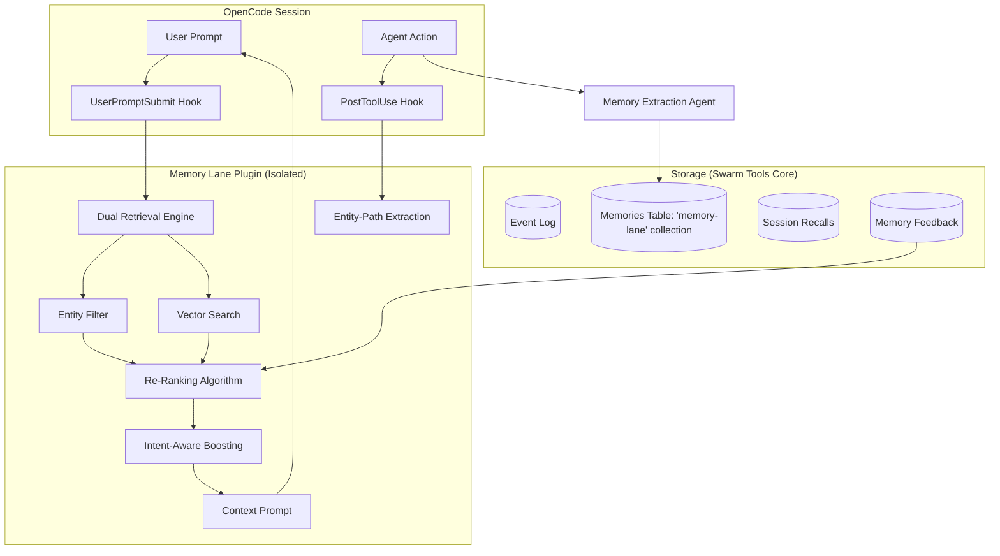

# Memory Lane System Design for Swarm Tools

This document outlines the design for "Memory Lane," an advanced persistent memory system for Swarm Tools, inspired by Andy's Memory System. It addresses the gaps in the current semantic memory implementation and proposes a robust, entity-aware, and adaptive learning architecture.

## 1. Executive Summary

The current Swarm Tools memory system provides basic semantic search but lacks the nuanced taxonomy, entity awareness, and intent-based boosting required for truly "smart" context injection. **Memory Lane** transforms memory from a simple "knowledge store" into a "behavioral guidance system" by prioritizing corrections, decisions, and commitments.

**Plugin-First Strategy:** This system is designed as a non-invasive sidecar plugin. It leverages existing Swarm Tools primitives (`MemoryStore`, `PGLite`) as a database driver while isolating all "Smart" logic in a dedicated namespace to ensure conflict-free upstream merges.

---

## 2. Current Gaps vs. Desired State

| Feature | Current Swarm Tools | Memory Lane (Plugin Extension) |
| :--- | :--- | :--- |
| **Taxonomy** | Generic "information" | Packed in `metadata` (Correction, Decision, etc.) |
| **Retrieval** | Vector OR FTS | **Sidecar Dual-Search** (Entity Filter + Semantic Rank) |
| **Intent Boosting** | None | **Query-Aware Boosting** (e.g., "mistake" boosts corrections) |
| **Entity Awareness** | Tags only | Slugs packed in `metadata.entity_slugs` |
| **Feedback** | Placeholder `validate` | Persistence-based scoring (+10%/-30%/-50%) |
| **Injection** | Manual tool call | **Hook-based Auto-Injection** (Zero-Config) |
| **Maintenance** | Core modification | **Conflict-Free Plugin** (Isolated directory) |

---

## 3. Proposed Architecture

### 3.1 Logical Flow (Mermaid)



### 3.2 Data Flow Diagram (ASCII)

```text
┌─────────────────────────────────────────────────────────┐
│                   OpenCode Session                      │
│  ┌─────────────┐                  ┌──────────────┐      │
│  │ User Prompt │                  │ Agent Action │      │
│  └──────┬──────┘                  └──────┬───────┘      │
└─────────│────────────────────────────────│──────────────┘
          │                                │
          ▼                                ▼
┌──────────────────────────────────┐    ┌──────────────────┐
│   Memory Lane Plugin (Sidecar)   │    │ Memory Catcher   │
│  ┌────────────────────────────┐  │    │  (Extraction)    │
│  │ Dual Retrieval Engine      │  │    └────────┬─────────┘
│  │ - Entity Filter            │  │             │
│  │ - Vector Search            │  │             │
│  └──────────────┬─────────────┘  │             │
│                 │                │             │
│  ┌──────────────▼─────────────┐  │             │
│  │ Re-Ranking & Intent Boost  │◄─┼─────────────┼────────┐
│  └──────────────┬─────────────┘  │             │        │
│                 │                │             │        │
│  ┌──────────────▼─────────────┐  │             │        │
│  │ Context Injection Hook     │──┼────────┐    │        │
│  └────────────────────────────┘  │        │    │        │
└──────────────────────────────────┘        │    │        │
                                            ▼    ▼        │
┌─────────────────────────────────────────────────────────┐
│               Storage (Swarm Tools Primitives)          │
│  ┌────────────┐   ┌────────────┐   ┌────────────┐       │
│  │ Event Log  │   │  Memories  │   │ Feedback   │───────┘
│  └────────────┘   └────────────┘   └────────────┘
└─────────────────────────────────────────────────────────┘
```

---

## 4. Implementation Details

### 4.1 Metadata Namespacing
To avoid schema modifications, all Memory Lane specific data will be packed into the existing `metadata` JSONB column:
*   `metadata.memory_type`: The taxonomy type (correction, decision, etc).
*   `metadata.entity_slugs`: Array of resolved entities.
*   `metadata.lane_version`: Tracking for future internal migrations.

### 4.2 Sidecar Adapter Pattern
A new `MemoryLaneAdapter` will wrap the existing `MemoryAdapter` via composition. This allows us to add smart search features without modifying the upstream source code.

### 4.3 Hybrid Dual-Search Algorithm
Retrieval will follow a two-step process:
1.  **Identify Entities:** Extract named entities (Indy Hall, Neal Brown) using a local LLM or regex-based resolver.
2.  **Filter & Rank:** If entities found, filter memories strictly by the entity slug in `metadata`, then rank the subset by semantic similarity.
3.  **Fallback:** If no entities detected, fall back to pure semantic vector search with an adaptive similarity floor (0.50).

### 4.4 Query-Aware Type Boosting
The system will scan the user query for intent keywords:
*   "mistake", "wrong", "error" → **+15% Boost** to `correction` and `gap`.
*   "decided", "chose", "choice" → **+15% Boost** to `decision`.
*   "pattern", "usually", "habit" → **+15% Boost** to `pattern_seed`.

---

## 5. Plugin Implementation Proposal

### 5.1 Directory Isolation
All logic resides in `packages/opencode-swarm-plugin/src/memory-lane/`:
*   `adapter.ts`: Re-ranking and Intent logic.
*   `taxonomy.ts`: Types and priority levels.
*   `hooks.ts`: OpenCode context injection.
*   `tools.ts`: New `memory-lane_*` tool definitions.

### 5.2 Storage Strategy
*   **Collection:** All Memory Lane entries will be stored under the `memory-lane` collection ID.
*   **Zero Schema Change:** Uses standard `MemoryStore` provided by Swarm Tools.

---

## 6. Actionable Roadmap (Implementation TODO)

### Phase 1: Core Plugin Infrastructure
- [x] **Scaffold Plugin Directory:** Create `src/memory-lane/` isolated from core.
- [x] **Sidecar Adapter:** Implement `MemoryLaneAdapter` that wraps core `MemoryAdapter`.
- [x] **Tool Definitions:** Define `memory-lane_store` and `memory-lane_find` tools.
- [x] **Taxonomy Definition:** Finalize `MemoryType` enum and priority weights in `taxonomy.ts`.

### Phase 2: Metadata & Taxonomy Integration
- [x] **Metadata Packing:** Implement logic to JSON-serialize taxonomy and entity data into the core `metadata` column.
- [x] **Schema Validation:** Add Zod validation for `MemoryLaneMetadata` during retrieval to ensure forward compatibility.
- [ ] **Migration Helper:** Add a utility to tag existing 'default' memories with a generic `learning` type.

### Phase 3: Smart Retrieval Engine
- [x] **Intent Keyword Detection:** Port keyword scanning (mistake, choice, habit) to `adapter.ts`.
- [x] **Weight-Based Re-ranking:** Implement the `finalScore = res.score * typeWeight * intentBoost` formula.
- [x] **Strict Entity Filtering:** Implement slug-based subset filtering before re-ranking.
- [x] **Adaptive Similarity Floor:** Implement dynamic `min_score` thresholds (0.50 for semantic, 0.40 for entity-filtered).

### Phase 4: Entity Resolution System
- [x] **Regex Resolver:** Implement a lightweight resolver for `project:name` and `agent:name` from text.
- [x] **Path-Based Extraction:** Implement `Hook2 (PostToolUse)` logic to extract entity slugs from file paths (e.g., `src/features/auth` -> `feature:auth`).
- [x] **Ambiguity Handling:** Add logic to return "Clarification Required" if multiple entity slugs match a fuzzy query.

### Phase 5: Feedback & Persistence
- [x] **Feedback Persistence:** Create logic to store aggregate scores in PGLite JSONB metadata.
- [x] **Scoring Adjustment:** Integrate feedback counts into the re-ranking algorithm (+10% for helpful, -50% for harmful).
- [x] **Session Recall Tracking:** Store which memories were surfaced in the current `sessionID` to avoid duplicate injections.

### Phase 6: Seamless Integration
- [x] **Injection Hook:** Implement `createMemoryLaneHook()` for session compaction.
- [x] **Hook Registration:** Connect the hook to the `SwarmPlugin` entry point.
- [x] **Documentation Lore:** Update `README.md` with examples of how to use Memory Lane for behavior correction.
