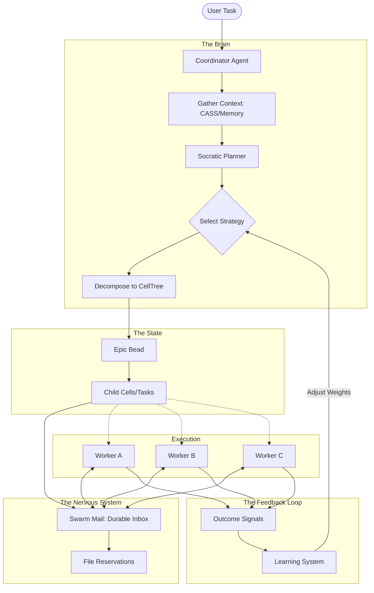
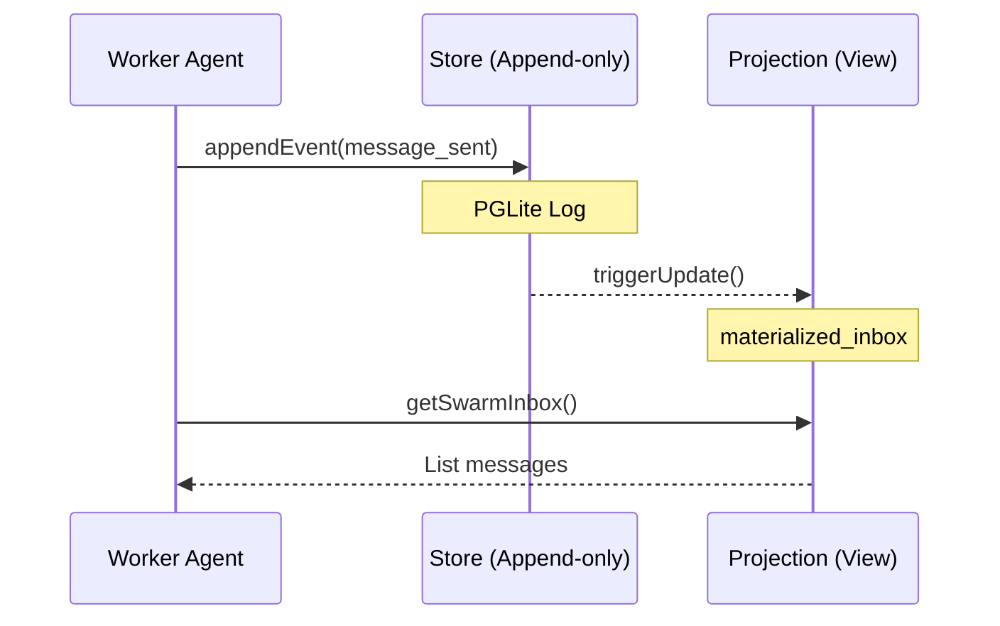
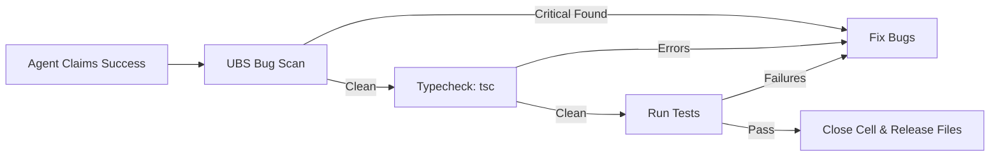

# Swarm Tools Architecture & Design Patterns

## 1. System Visualization

### 1.1 High-Level Swarm Orchestration Flow (Mermaid)

### 1.2 Event Sourcing & Materialized Views

### 1.3 Verification Gate Process

---

## 2. Core Design Patterns

### 2.1 Local-First Event Sourcing
**Context:** Managing complex, multi-agent state that must survive context window exhaustion and process restarts without external servers.

**Pattern:**
Instead of storing "Current State", the system stores a sequence of immutable events. Current state is derived by replaying these events or querying materialized views (Projections).

**Implementation:**
- **Event Log:** `packages/swarm-mail/src/events.ts` defines the schema. Events are appended to a PGLite table.
- **Projections:** `packages/swarm-mail/src/projections.ts` creates optimized read-models (e.g., `getInbox`, `getActiveReservations`) by aggregating events.
- **Benefits:**
    - **Auditability:** Full history of *why* the code is in its current state.
    - **Resumability:** If the LLM context fills up (`Context Death`), the new session simply reconnects to the PGLite DB and queries the Projections to resume exactly where it left off.

### 2.2 The Actor Model (Swarm Mail)
**Context:** Agents need to communicate and coordinate (locking files, handing off work) without shared memory or race conditions.

**Pattern:**
Each Agent is an "Actor" with a private `DurableMailbox`. Agents communicate exclusively by sending messages to other actors' mailboxes.

**Implementation:**
- **DurableMailbox:** An abstraction over the Event Store. Sending a message = appending a `MessageSent` event.
- **Processing:** Agents "check mail" by querying their inbox projection.
- **Addressing:** Agents are addressed by `AgentName`.
- **Locking:** Implements a Distributed Lock pattern using the Actor system. To edit `file.ts`, an actor sends a `ReserveRequest`. The system (via projections) checks if any other actor holds a valid lease.

### 2.3 Socratic Planning
**Context:** Decomposition of complex tasks often fails if the agent jumps to solutions too quickly.

**Pattern:**
A multi-turn reasoning process derived from the Socratic Method.
1.  **Question:** Analyze the task and ask clarifying questions.
2.  **Alternatives:** Propose 2-3 distinct strategies (e.g., "File-based split" vs "Feature-based split").
3.  **Recommendation:** Select the best strategy based on context.
4.  **Execution:** Only then generate the decomposition.

**Implementation:**
- Located in `packages/opencode-swarm-plugin/src/swarm-decompose.ts`.
- The `swarm_plan_interactive` tool forces this state transition (`questioning` -> `alternatives` -> `recommendation`).

### 2.4 Confidence Decay (Learning)
**Context:** "Best practices" change. A strategy that worked for React 16 might fail for React 18. Static prompt engineering becomes stale.

**Pattern:**
Learned patterns have a "Half-Life". Their weight in the decision-making process decays over time unless re-validated by a successful outcome.

**Implementation:**
- **Outcome Signals:** Every closed Cell records `duration`, `retries`, and `errors`.
- **Decay Function:** `value * 0.5 ^ (age / half_life)`.
- **Feedback Loop:** High success rates "boost" a pattern's confidence. High failure rates inverted it into an "Anti-Pattern".

### 2.5 Verification Gate
**Context:** LLMs often hallucinate completion or introduce regressions.

**Pattern:**
A rigid, programmatic gate that prevents a task from transitioning to `Closed` state unless specific verification commands pass.

**Implementation:**
- **Tool:** `swarm_complete`
- **Logic:**
    1.  **Identify:** Agent claims "I fixed the bug".
    2.  **Scan:** System runs `ubs scan` (Ultimate Bug Scanner).
    3.  **Typecheck:** System runs `tsc`.
    4.  **Verify:** System runs tests for touched files.
    5.  **Commit:** Only if ALL pass is the Cell closed.

## 3. Implementation Patterns (Code Level)

### 3.1 The Result/Either Pattern (Effect-TS Influence)
While not strictly using the `Either` type everywhere, the codebase heavily leans on returning structured `Result` objects rather than throwing exceptions.
- **Pattern:** `type Result<T> = { success: true, data: T } | { success: false, error: string }`
- **Usage:** Tools return JSON objects with explicit `success` flags, allowing the LLM to handle "soft failures" (e.g., "File locked, try again later") intelligently without crashing the interaction loop.

### 3.2 Feature Flags via Tool Availability
The system is designed to degrade gracefully.
- **Pattern:** `tool-availability.ts` checks for the presence of binaries (`git`, `ubs`, `cass`).
- **Usage:** If `ubs` is missing, the `swarm_complete` tool automatically degrades to skipping the scan, warning the user, but allowing the workflow to proceed.

### 3.3 The "Hive" (Entity Component System)
The renaming from "Beads" to "Hive" reflects a shift towards an ECS-like structure.
- **Entity:** Cell (The Task).
- **Component:** Status, Assignments, Files, Dependencies.
- **System:** The Coordinator (processes Cells).
