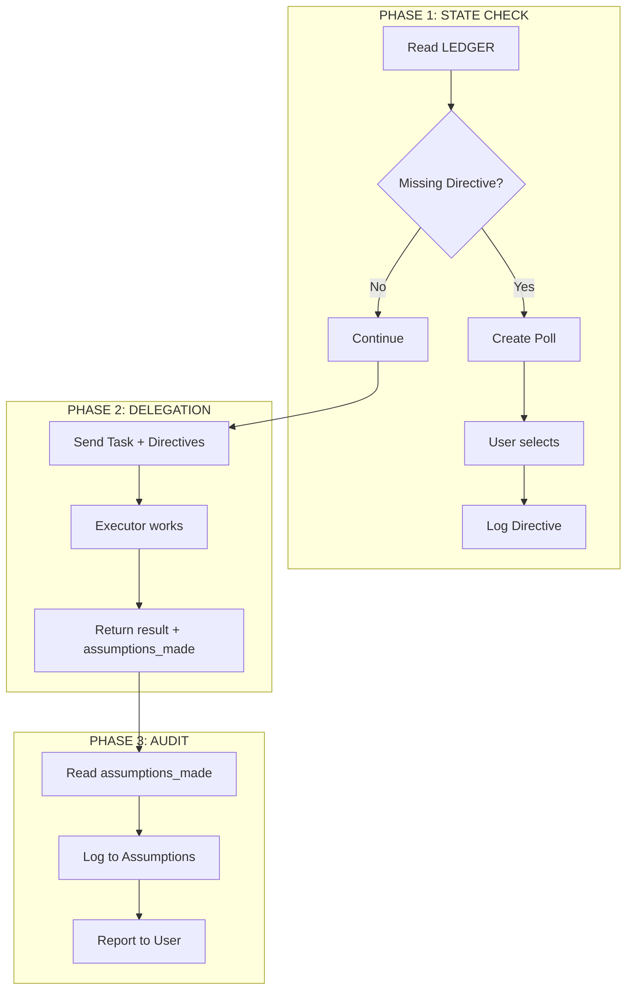

# ADR 008: Governance-First Orchestration (v4.0)

## Status

Done

## Context

The v3.0 orchestrator (ADR-004) operates as a **Task-Driven Router**:
- Chief-of-Staff dispatches work and aggregates results
- Interviewer asks open-ended questions when information is missing
- Sub-agents make silent decisions during execution

This model suffers from **Scope Drift** — agents make reasonable assumptions that accumulate, leading the project into states unintended by the user.

### Gap Analysis

| Component | v3.0 Current | v4.0 Vision | Gap |
|-----------|--------------|-------------|-----|
| **State** | Generic `Learnings` | Directives (Law) + Assumptions (Debt) | No compliance tracking |
| **CoS Role** | Router (reactive) | Governor (proactive) | Only reacts after completion |
| **Interaction** | Interviewer (open questions) | Strategic Polling (A/B/C) | Missing polling mechanism |
| **Sub-agents** | Return work result only | Report `assumptions_made` | No assumption declaration |

## Decision

Upgrade to **Governance-First Architecture** with Chief-of-Staff as the **Governor**.

### Governance Schema

New section in LEDGER.md:

```markdown
## Governance

### Directives (The Law)
- [x] Tech Stack: Next.js + Bun (User, 2024-01-01)
- [x] Testing: Vitest only (User, 2024-01-01)

### Assumptions (The Debt)
- [?] UI Library: Shadcn/ui (Executor: "Standard for Next.js")
- [?] Auth: Clerk (Oracle: "Fastest implementation")
```

| State Type | Mutability | Source | Action |
|------------|------------|--------|--------|
| **Directives** | Immutable | User/Polling | Agents MUST obey |
| **Assumptions** | Pending review | Agents | Log for async review |

### Role Revisions

| Agent | v3.0 | v4.0 |
|-------|------|------|
| **Chief-of-Staff** | Traffic Controller | Governor & Strategist |
| **Interviewer** | Gatekeeper | Strategist (polling) |
| **Oracle** | Strategic Planner | Tactical Architect |
| **Executor** | Builder | Transparent Worker |

### 3-Phase Governance Loop



---

## Workflow Patterns: Before & After

### Ask User Question Pattern

**Before (v3.0): Gatekeeper**
```
User: "Build a backend"
      ↓
CoS spawns Interviewer
      ↓
Interviewer: "What database? What auth? What framework?"
      ↓
User: "Just pick something standard"
      ↓
Interviewer: "I cannot assume. Please specify."
```
*User feels blocked.*

**After (v4.0): Strategic Partner**
```
User: "Build a backend"
      ↓
CoS checks Directives → Missing "Database"
      ↓
CoS: "Strategic Poll: No Directive for Database.
      (1) Postgres (scalable)
      (2) SQLite (simple)
      Reply 1 or 2."
      ↓
User: "1"
      ↓
CoS: "Directive logged. Proceeding..."
```
*User feels empowered.*

---

### SDD Workflow Pattern

**Before (v3.0): Distributed**
```
User → CoS → Spawns Interviewer → (Multi-turn chat) → Ledger
              ↓
         Spawns Oracle → (Decomposition) → Ledger
              ↓
         Spawns Executor → (Code) → Done
```
*Problem: Multiple context switches. CoS is passive. No assumption tracking.*

**After (v4.0): Centralized Governance**
```
User → CoS (Governor)
        │
        ├─ PHASE 1: STATE CHECK
        │   ├─ Load Directives
        │   └─ Missing? → Poll → Log Directive
        │
        ├─ PHASE 2: DELEGATION
        │   ├─ Spawn Oracle (with Directives)
        │   │   └─ Returns plan + assumptions_made
        │   ├─ Spawn Executor (with Directives)
        │   │   └─ Returns code + assumptions_made
        │
        └─ PHASE 3: AUDIT
            ├─ Log assumptions to Ledger
            └─ Report: "Done. Check Assumptions."
```
*Benefit: Single accountability, drift tracking.*

---

## Human-in-the-Loop Interaction

### Polling (Primary)
- CoS presents options when Directive is missing
- User selects → immediately becomes Directive
- Fast, low cognitive load

### Interviewer (Fallback)
- Only for multi-turn deep ambiguity
- When trade-offs require extended discussion
- NOT for simple missing Directives

### Assumption Review (Async)
- After workflow, user reviews `## Assumptions`
- Approve → promotes to Directive
- Reject → CoS adjusts next iteration

---

## Consequences

### Positive

- **Drift Prevention**: Every agent choice is logged, reviewable
- **Reduced Friction**: Polls replace open-ended questions
- **Trust Scaling**: User can "open the throttle" safely
- **Accountability**: Clear trail of who decided what

### Negative

- **Complexity**: Ledger parsing logic increases
- **Token Usage**: Context size grows (Governance section)
- **Judgment Dependency**: Quality depends on CoS model's ability to detect assumptions

## Files to Modify

1. `src/orchestrator/ledger.ts` - Add Governance types
2. `src/orchestrator/chief-of-staff/SKILL.md` - 3-phase workflow
3. `src/orchestrator/chief-of-staff/agents/interviewer/SKILL.md` - Polling
4. `src/orchestrator/chief-of-staff/agents/executor/SKILL.md` - assumptions_made
5. `src/orchestrator/chief-of-staff/agents/oracle/SKILL.md` - assumptions_made


## References

- [ADR-004: SDD Workflow v3.0](./004-orchestrator-sdd-workflow.md)
- [ADR-003: LEDGER-First Coordination](./003-ledger-first-coordination.md)
