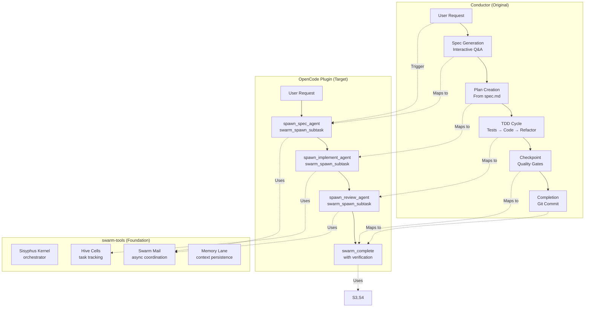
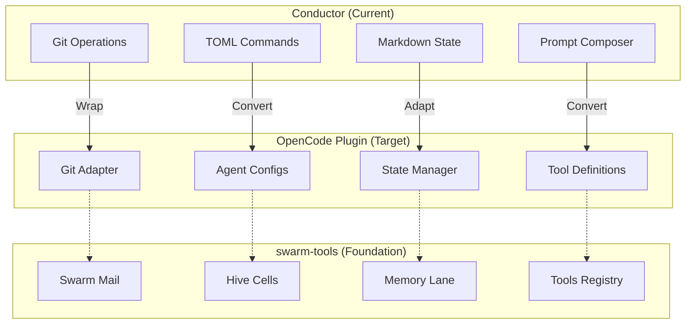
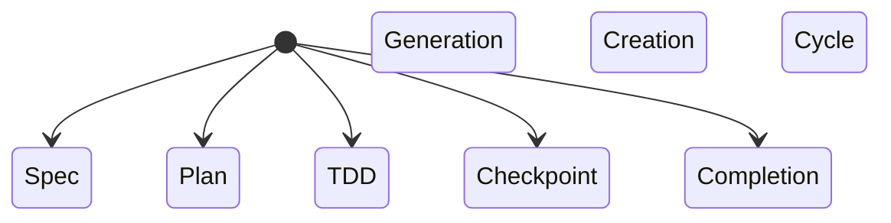

# Conductor Architecture

> **Purely Prompt-Based Gemini CLI Extension**

## Table of Contents

1. [Overview](#1-overview)
2. [System Design](#2-system-design)
3. [TOML Command Definitions](#3-toml-commands)
4. [Markdown Template System](#4-markdown-templates)
5. [Spec-Driven Workflow](#5-spec-driven-workflow)
6. [State Management](#6-state-management)
7. [Git Integration](#7-git-integration)
8. [Multi-Language Support](#8-multi-language)
9. [OpenCode Plugin Conversion](#9-opencode-plugin-roadmap)
10. [Component Reference](#10-component-breakdown)

---

## 11. Workflow Analysis

### Conductor Workflow to OpenCode Mapping



### Phase Transition Mappings

| Conductor Phase     | OpenCode Plugin         | swarm-tools Pattern                   |
| ------------------- | ----------------------- | ------------------------------------- |
| **Spec Generation** | `spawn_spec_agent`      | `swarm_spawn_subtask` → spec agent    |
| **Plan Creation**   | `spawn_plan_agent`      | `swarm_spawn_subtask` → planner agent |
| **TDD Cycle**       | `spawn_implement_agent` | `swarm_spawn_subtask` → worker agent  |
| **Checkpoint**      | `quality_gate_check`    | Tool-based validation                 |
| **Completion**      | `swarm_complete`        | `swarm_complete` with verification    |

### State Transition Mapping

**Conductor (markdown-based):**

```markdown
# status.md

## Status: [~] <!-- In progress -->

## Current Phase: Plan

**Tasks**

- [x] Generate spec.md
- [ ] Create plan.md
- [ ] Implement plan.md
- [ ] Write tests
```

**OpenCode (swarm-tools):**

```typescript
// Hive cell state
{
  id: "bd-123.1",
  title: "Create plan.md",
  status: "open",  // 'open' | 'in_progress' | 'blocked' | 'closed'
  priority: 2,
  parent_id: "epic-456",
}

// Progress tracking
await swarm_progress({
  project_key: "/path/to/project",
  agent_name: "SwiftHawk",
  bead_id: "bd-123.1",
  status: "in_progress",
  progress_percent: 50,
  message: "Generating plan.md from spec.md",
});
```

### Coordination Flow Comparison

**Conductor (synchronous):**

```
User → Conductor CLI
  ↓
Parse command
  ↓
Compose prompt
  ↓
Execute Gemini CLI (blocking)
  ↓
Update markdown state
  ↓
Git commit
  ↓
Return to user
```

**OpenCode Plugin (async, event-driven):**

```
User → Swarm coordinator
  ↓
swarm_spawn_subtask(spec_agent)
  ↓
spec_agent sends swarmmail(to=['implement_agent'])
  ↓
implement_agent executes (async)
  ↓
implement_agent sends swarmmail(progress update)
  ↓
review_agent spawns for quality gates
  ↓
swarm_complete calls verification
  ↓
All agents notified via swarmmail
```

## 12. API Compatibility Layer

### Adapter Pattern Implementation

```typescript
// src/conductor/adapter.ts
/**
 * Adapter layer to maintain backward compatibility with Conductor's markdown format
 * while integrating with swarm-tools.
 */

export class ConductorAdapter {
  private stateManager: StateManager;
  private gitAdapter: GitAdapter;

  /**
   * Convert Conductor command to swarm-tools tool call
   */
  async executeCommand(command: string, args: Record<string, unknown>): Promise<CommandResult> {
    switch (command) {
      case 'newTrack':
        return await this.spawnSpecAgent(args.track_name as string);
      case 'implement':
        return await this.spawnImplementAgent(args.track_name as string);
      case 'review':
        return await this.spawnReviewAgent(args.track_name as string);
      default:
        throw new Error(`Unknown command: ${command}`);
    }
  }

  /**
   * Spawn spec agent for track creation
   */
  private async spawnSpecAgent(trackName: string): Promise<CommandResult> {
    const subtask = await spawnSubtask({
      bead_id: `bd-${Date.now()}`,
      epic_id: `conductor-${trackName}`,
      subtask_title: `Generate spec for ${trackName}`,
      subtask_description: 'Interactive Q&A to create specification document',
      files: [`tracks/${trackName}/spec.md`],
      shared_context: 'Use conductor spec template pattern',
    });

    return {
      success: true,
      subtask_id: subtask.bead_id,
      message: `Spawned spec agent for ${trackName}`,
    };
  }

  /**
   * Query Conductor markdown state for swarm context
   */
  async getStateContext(trackName: string): Promise<string> {
    const state = await this.stateManager.getTrack(trackName);
    const phase = state.phase;
    const pendingTasks = state.tasks.filter((t) => t.status === 'pending');

    return `
Current Track: ${trackName}
Phase: ${phase}
Pending Tasks (${pendingTasks.length}):
${pendingTasks.map((t) => `- ${t.description}`).join('\n')}
    `.trim();
  }

  /**
   * Convert swarm-tools progress to Conductor markdown updates
   */
  async updateMarkdownFromProgress(
    trackName: string,
    taskId: string,
    status: 'pending' | 'in-progress' | 'complete'
  ): Promise<void> {
    await this.stateManager.updateTask(trackName, taskId, status);

    // Git commit on task completion
    if (status === 'complete') {
      await this.gitAdapter.commit(`Complete task: ${taskId}`, {
        files: [`tracks/${trackName}/status.md`],
      });
    }
  }
}
```

### Tool-to-Agent Bridge

```typescript
// src/conductor/tool-bridge.ts
/**
 * Bridge between Conductor tools and swarm-tools agents
 */

export const conductorTools = {
  /**
   * Tool: conductor_status
   * Read track status from markdown files
   */
  conductor_status: {
    name: 'conductor_status',
    description: 'Get current status of a Conductor track',
    parameters: {
      track_name: {
        type: 'string',
        required: true,
      },
    },
    handler: async ({ track_name }: { track_name: string }) => {
      const state = await stateManager.getTrack(track_name);
      return {
        track: track_name,
        phase: state.phase,
        tasks: state.tasks,
        quality_gates: state.quality_gates,
      };
    },
  },

  /**
   * Tool: conductor_list_tracks
   * List all available tracks
   */
  conductor_list_tracks: {
    name: 'conductor_list_tracks',
    description: 'List all Conductor tracks',
    parameters: {},
    handler: async () => {
      const tracksDir = await fs.readdir('tracks', { withFileTypes: true });
      return tracksDir.filter((dirent) => dirent.isDirectory()).map((dirent) => dirent.name);
    },
  },

  /**
   * Tool: conductor_complete_phase
   * Mark current phase as complete
   */
  conductor_complete_phase: {
    name: 'conductor_complete_phase',
    description: 'Complete current phase and advance to next',
    parameters: {
      track_name: {
        type: 'string',
        required: true,
      },
    },
    handler: async ({ track_name }: { track_name: string }) => {
      const state = await stateManager.getTrack(track_name);
      const nextPhase = getNextPhase(state.phase);
      await stateManager.setPhase(track_name, nextPhase);

      await swarmmail_send({
        to: ['coordinator'],
        subject: `Phase transition: ${track_name}`,
        body: `Transitioning from ${state.phase} to ${nextPhase}`,
        thread_id: track_name,
      });

      return { success: true, previous: state.phase, next: nextPhase };
    },
  },
};

function getNextPhase(current: TrackState['phase']): TrackState['phase'] {
  const phases: TrackState['phase'][] = ['spec', 'plan', 'implement', 'review', 'complete'];
  const currentIndex = phases.indexOf(current);
  return phases[currentIndex + 1] || 'complete';
}
```

## 13. Phased Implementation Plan

### Phase 1: Foundation (Week 1-2)

**Goal**: Establish plugin infrastructure and basic state management.

**Tasks**:

1. **Setup project structure**
   - Create `src/conductor/` directory
   - Initialize TypeScript config
   - Add build scripts to `mise.toml`

2. **Implement core types**
   - Define `TrackState`, `Task`, `QualityGate` interfaces
   - Create `WorkflowPhase` union type
   - Define command configuration schemas

3. **Create StateManager**
   - Markdown file parser
   - CRUD operations for track state
   - Task status updating
   - Phase transition logic

4. **Basic CLI wrapper**
   - Parse command arguments
   - Execute basic commands (newTrack, status)
   - Output formatting

**Success Criteria**:

- Can create new track with spec.md
- Can read track status
- Can update task status
- TypeScript compiles without errors

### Phase 2: Tool Layer (Week 3-4)

**Goal**: Expose Conductor functionality as OpenCode tools.

**Tasks**:

1. **Tool definitions**
   - `conductor_new_track` tool
   - `conductor_status` tool
   - `conductor_list_tracks` tool
   - `conductor_update_task` tool
   - `conductor_complete_phase` tool

2. **Tool registry integration**
   - Register tools in plugin entry point
   - Export tools for agent use
   - Add tool documentation

3. **Template system**
   - Markdown template processor
   - Variable substitution engine
   - Template variants (spec, plan, status)

4. **CLI adapter**
   - Map Conductor CLI commands to tools
   - Preserve command-line interface
   - Error handling and validation

**Success Criteria**:

- All tools registered in OpenCode
- Tools accessible to agents
- Template system working
- Backward compatible with Conductor CLI

### Phase 3: Swarm Integration (Week 5-6)

**Goal**: Integrate with swarm-tools coordination system.

**Tasks**:

1. **Swarm-mail hooks**
   - Listen for phase completion events
   - Track progress updates
   - Coordinate agent spawning

2. **Agent definitions**
   - Spec agent (interactive Q&A)
   - Implementation agent (TDD cycle)
   - Review agent (quality gates)

3. **Sisyphus kernel integration**
   - Create epic for tracks
   - Spawn subtasks for phases
   - Manage task dependencies

4. **Progress tracking**
   - Map swarm_progress to task updates
   - Sync with markdown state
   - Git commits on phase completion

**Success Criteria**:

- Agents spawn correctly
- Swarm-mail coordination working
- Progress synced to markdown
- Git commits triggered

### Phase 4: Git Integration (Week 7-8)

**Goal**: Implement git operations and audit trail.

**Tasks**:

1. **Git adapter**
   - Commit operations
   - Git notes for AI summaries
   - Commit message formatting

2. **Commit templates**
   - Conductor commit templates
   - Variable substitution
   - Conventional commits format

3. **Audit trail**
   - Track all git operations
   - Store in memory-lane
   - Query for agent context

4. **Hook registration**
   - Git post-commit hook
   - Swarm-mail event handler
   - Status updates on commits

**Success Criteria**:

- Git commits automated
- Notes attached to commits
- Audit trail populated
- Swarm-mail hooks working

### Phase 5: Quality Gates (Week 9-10)

**Goal**: Implement quality gate validation.

**Tasks**:

1. **Quality gate definitions**
   - Test coverage threshold
   - Type checking (no errors)
   - Linting (no errors)

2. **Validation tools**
   - `test_coverage` tool
   - `typecheck` tool
   - `lint` tool

3. **Quality gate agent**
   - Validate before completion
   - Report failed gates
   - Block completion if gates fail

4. **Styleguide resolver**
   - Load language-specific rules
   - Apply to generated code
   - Multi-language support

**Success Criteria**:

- Quality gates enforced
- Validation automated
- Styleguide resolution working
- Multi-language support

### Phase 6: Testing & Documentation (Week 11-12)

**Goal**: Ensure reliability and usability.

**Tasks**:

1. **Unit tests**
   - StateManager tests
   - GitAdapter tests
   - Tool handler tests
   - Template processor tests

2. **Integration tests**
   - End-to-end workflow tests
   - Agent coordination tests
   - Swarm-mail hook tests
   - Git integration tests

3. **Documentation**
   - User guide
   - API documentation
   - Migration guide (Conductor → OpenCode)
   - Architecture diagrams

4. **Examples**
   - Sample track creation
   - Example workflow
   - Tool usage examples
   - Agent configuration examples

**Success Criteria**:

- All tests passing
- Code coverage > 80%
- Documentation complete
- Examples working

### Phase 7: Release & Migration (Week 13-14)

**Goal**: Launch plugin and support migration.

**Tasks**:

1. **Package publication**
   - Build distribution
   - Update package.json
   - Publish to npm

2. **Migration tools**
   - Import existing Conductor tracks
   - Convert markdown to plugin format
   - Preserve git history

3. **Release notes**
   - Document new features
   - Highlight migration path
   - Known issues and workarounds

4. **Support materials**
   - FAQ
   - Troubleshooting guide
   - Migration tutorials

**Success Criteria**:

- Plugin published
- Migration tools functional
- Release notes published
- Users can migrate successfully

## 14. Risk Assessment & Mitigation

### Technical Risks

| Risk                                    | Likelihood | Impact | Mitigation                                   |
| --------------------------------------- | ---------- | ------ | -------------------------------------------- |
| **Markdown parsing complexity**         | Medium     | High   | Use robust parser, extensive test coverage   |
| **Swarm-mail async coordination bugs**  | Medium     | High   | Thorough integration testing, error handling |
| **Git operation failures**              | Low        | High   | Retry logic, fallback to manual commit       |
| **State desynchronization**             | Medium     | High   | Atomic updates, checksums, validation        |
| **Template variable substitution bugs** | Low        | Medium | Unit tests for all templates                 |

### Migration Risks

| Risk                                | Likelihood | Impact   | Mitigation                                      |
| ----------------------------------- | ---------- | -------- | ----------------------------------------------- |
| **Users resist plugin adoption**    | Medium     | High     | Provide migration guide, backward compatibility |
| **Breaking changes in swarm-tools** | Low        | High     | Version pinning, abstraction layer              |
| **Performance degradation**         | Low        | Medium   | Benchmarking, optimization                      |
| **Data loss during migration**      | Low        | Critical | Backup tools, dry-run mode, verification        |

## 15. Success Metrics

### Technical Metrics

- **Code Coverage**: > 80%
- **Test Pass Rate**: 100%
- **Type Safety**: No TypeScript errors
- **Build Time**: < 30 seconds
- **Bundle Size**: < 500KB

### Functional Metrics

- **Command Completion Rate**: > 95%
- **State Sync Accuracy**: 100%
- **Git Commit Success Rate**: > 99%
- **Quality Gate Pass Rate**: > 80%
- **Agent Coordination Success**: > 95%

### User Experience Metrics

- **Onboarding Time**: < 15 minutes
- **Migration Time**: < 1 hour per project
- **Error Recovery Time**: < 5 minutes
- **Documentation Coverage**: All features documented

## 16. Future Enhancements

### Post-Release Features (P3-P4)

1. **Visual dashboard**
   - Track visualization
   - Progress charts
   - Quality gate status

2. **Real-time collaboration**
   - Multiple users per track
   - Live updates via websockets
   - Conflict resolution

3. **AI assistance integration**
   - Auto-suggest tasks
   - Generate commit messages
   - Identify blockers

4. **Analytics**
   - Track completion time
   - Common patterns
   - Bottleneck identification

5. **Integrations**
   - GitHub/GitLab sync
   - CI/CD pipeline integration
   - Issue tracker integration (Jira, Linear)

**What is Conductor?**

Conductor is a Gemini CLI extension that implements **Context-Driven Development (CDD)** through **protocol-driven prompts** and **markdown-based state management**, with **zero executable code**.

### Core Philosophy

Conductor embodies a unique architectural approach:

1. **Prompts as First-Class Citizens**: TOML definitions drive all command behavior
2. **Markdown as Database**: No traditional database - all state persisted as text files
3. **Git as Persistence Layer**: Commits, notes, and audit trails provide history and context
4. **Interactive Workflows**: Spec generation is conversational, not declarative

> **The LLM guides the user, the user guides the LLM**

This architecture creates a **conversation-driven development environment** where:

- Commands feel like natural language requests to the AI
- Specifications emerge from dialogue through Q&A
- State is always visible and queryable
- Progress is tracked through markdown files
- Git operations serve as both version control and audit system

---

## 2. System Design

```mermaid
flowchart TB
    User[User Request] -->|Prompt System|
    PromptSystem -->|Command Composer|
    CommandComposer -->|Gemini CLI Engine|
    GeminiCLIEngine -->|Template Processor|

    PromptSystem -->|Markdown Templates|
    PromptSystem -->|Default Prompts|

    CommandComposer -->|Gemini CLI Engine|
    GeminiCLIEngine -->|Template Processor|

    TemplateProcessor -->|Markdown Files|
```

### Key Components

#### 2.1 Prompt System

**Purpose:** Converts command definitions into composed prompts for the AI.

**Inputs:**

- `gemini-extension/commands/*.toml` - Command definitions
- Environment variables (`.env` or command flags)

**Outputs:**

- Structured prompts with sections, defaults, and examples
- Composed final prompt strings ready for AI processing

**Key Features:**

- **Section-based organization**: Commands grouped by logical sections
- **Variable substitution**: `${var.name}` syntax in prompts and defaults
- **Default values**: Fallback values when variables not set
- **Prompt chaining**: Multiple prompts can be composed together
- **Conditional logic**: Include/exclude sections for optional parameters

#### 2.2 Markdown Template System

**Purpose:** Provides template files for workflow execution.

**Templates:**

- `workflow.md` - Main workflow orchestrator template
- `spec.md` - Specification document template
- `plan.md` - Implementation plan template
- `status.md` - Progress tracking template
- `changes.md` - Change log template
- `logs.md` - Session log template

**Template Processing:**

1. Resolve variables (`${var}`)
2. Merge defaults with user-provided values
3. Apply workflow-specific sections
4. Write final markdown content

**Key Features:**

- **Workflow selection**: Templates matched to command sections
- **State machine integration**: Status tracking embedded in templates
- **Progressive enhancement**: Step-by-step task tracking
- **Quality gates**: Coverage and lint checks in templates

#### 2.3 Command Execution Layer

**Purpose:** Interprets TOML, composes prompts, executes commands, manages lifecycle.

**Execution Flow:**

```
1. Parse TOML definition
2. Load environment variables
3. Compose prompt from template + defaults
4. Execute via Gemini CLI
5. Update markdown state (workflow.md, status.md)
6. Post-process with hooks (git operations, notifications)
```

#### 2.4 State Management Layer

**Purpose:** Tracks workflow state using markdown files.

**State Files:**

- `tracks.md` - Track registry
- `tracks/{name}/` - Per-track directories
- `tracks/{name}/spec.md` - Specification
- `tracks/{name}/plan.md` - Implementation plan
- `tracks/{name}/status.md` - Progress tracking
- `tracks/{name}/changes.md` - Change log
- `tracks/{name}/logs.md` - Session logs

**State Transitions:**

```
spec.md → plan.md → status.md
plan.md → status.md (implementation complete)
status.md → status.md (review passed)
status.md → status.md (checkpoint reached)
```

#### 2.5 Git Integration Layer

**Purpose:** Persistent version control and audit trails.

**Features:**

- **Task commits**: Each completed task is a git commit
- **Git notes**: Store AI summaries as commit metadata
- **Commit templates**: Structured commit message templates
- **Audit trail**: History of all git operations for AI context
- **Status tracking**: Track which commits map to which markdown state

---

## 3. TOML Command Definitions

Conductor defines commands using TOML configuration files. This is a declarative approach to command definition.

### File Structure

```
gemini-extension/commands/
├── setup.toml
├── build.toml
├── test.toml
├── status.toml
├── newTrack.toml
└── shared.toml
```

### Command Definition Structure

```toml
[command.name]
description = "Human-readable description"
sections = [
  { section = "prompts", prompt = "..." },
  { section = "defaults", default = "..." },
  ...
```

### Key Sections

1. **[prompts]** - Instructions for AI prompt composition
2. **[defaults]** - Default values for variables
3. **[examples]** - Usage examples and edge cases

### Variable Substitution

Variables are referenced using `${var.name}` syntax:

```toml
[command.newTrack]
prompts = """
  Create a new track with name: ${track:name}

  You will guide me through creating this specification document.

  """

default_prompts = """
  ${track:name} specification document (spec.md)
  """
```

This allows prompts to reference each other's defaults:

```toml
[command.newTrack]
default_prompts = """
  ${track:name} implementation plan (plan.md)
  ${track:name} working directory (tracks/${track:name}/)
  ${track:name} specification document (tracks/${track:name}/spec.md)
  ${track:name} status tracking document (tracks/${track:name}/status.md)
  """
```

---

## 4. Markdown Template System

### Template File Types

1. **Workflow Templates**: Main orchestrators for commands
2. **State Templates**: Track current phase and progress
3. **Auxiliary Templates**: Subsections for specific operations (git, notes, logs)

### Template Structure

```markdown
# ${workflow:section}

## ${workflow:section}

### Context

${workflow:context}

### Action

${workflow:action}

## Plan

${workflow:plan}

### Status

${workflow:status}

## Quality Gates

${workflow:quality_gates}

## History

${workflow:history}
```

### Key Template Variables

- `${var.name}` - Track name
- `${track:name}` - Track directory path (e.g., `tracks/${track:name}/`)
- `${track:name}` - Spec file path (e.g., `tracks/${track:name}/spec.md`)

### State Machine Pattern

Templates use checkboxes `[ ]` and bullets `- ` ` for task completion:

```markdown
- [ ] Implement ${workflow:section}
- [ ] Plan ${workflow:section}
- [ ] Status ${workflow:section}
```

## 5. Spec-Driven Workflow

### Workflow Stages

```
1. **Spec Generation** (interactive Q&A → spec.md)
   - Ask questions about user intent
   - Generate requirement document
   - Create spec.md with `[ ]` and `- ` ` tasks
2. **Plan Creation** (spec.md → plan.md)
   - Generate implementation plan from requirements
   - `[ ] Implement`, `[ ] Refactor` tasks in plan.md
3. **TDD Cycle** (write test → implement → refactor)
   - Write failing test with assertions
   - Implement implementation code
   - Refactor to meet test requirements
   - Update status.md to reflect progress
   - Update status.md when tests pass
4. **Checkpoint** (manual verification)
   - `[ ] Verify` quality gates
   - `- ` ` Complete` phase
5. **Completion** (all tasks done)
   - Update status.md to mark spec complete
```

### Quality Gates

```markdown
${workflow:quality_gates}

### Coverage

- [ ] Test coverage > 80%
- [ ] No linting errors
- [ ] No type errors
```

---

## 6. State Management

### Directory Layout

```
tracks/
├── ${track1}/
│   ├── spec.md
│   ├── plan.md
│   ├── status.md
│   ├── changes.md
│   └── logs.md
└── ${track2}/
    ├── ...
```

### State Machine

**Status Values:**

- `[ ]` - Not started
- `[~]` - In progress
- `[x]` - Complete
- `[-]` - Reverted (checkpoint failed)

**Progress Tracking:**
status.md tracks current phase:

- spec.md → plan.md (generation)
- plan.md → status.md (planning)
- status.md → changes.md (implementation)
- status.md → logs.md (execution)
- status.md → status.md (review)
- status.md → status.md (checkpoint)

### Example status.md Content

```markdown
# Track Status

## Status: [~]

## Current Phase

### Plan

**Tasks**

- [ ] Generate spec.md
- [ ] Create plan.md
- [-] Implement plan.md
- [ ] Refactor plan.md
- [-] Write tests

## Quality Gates

### Coverage

- [ ] Test coverage: >80%
- [ ] No linting errors
```

---

## 7. Git Integration

### Commit Workflow

```
1. Task Complete
   → 2. Prompt System: Compose commit message
   → 3. Command Execution: Execute `git commit -m`
   → 4. State Manager: Update status.md
```

### Commit Message Template

Variables:

- `${task:description}` - What was accomplished
- `${track:name}` - Track name

### Example

```toml
[commit_message_template]
summary = "Completed ${task:description}"
```

### Git Notes

```
git notes add "${track:name}: ${summary}"

# View with: `git log --show-notes ${track:name}`
```

---

## 8. Multi-Language Support

### Code Styleguides

```
code_styleguides/
├── typescript.md
│   ├── interfaces.md
│   ├── conventions.md
│   ├── patterns.md
│   └── templates/
└── ${language}/
    ├── interfaces.md
    ├── conventions.md
    └── templates/
```

### Language-Agnostic Features

1. **Section selection**: Commands check `sections` to include language-specific prompts
2. **Code generation**: Language-specific rules applied to code
3. **TDD workflow**: Tests written in target language syntax
4. **Documentation**: Auto-generated in user's language

---

## 9. OpenCode Plugin Conversion

### Architectural Differences

| Aspect              | Conductor (Current)   | OpenCode Plugin (Target)      | Migration Complexity |
| ------------------- | --------------------- | ----------------------------- | -------------------- |
| **State**           | File-based (markdown) | Tool-based (swarm-tools)      | Medium               |
| **Persistence**     | Markdown files        | libSQL                        | Low                  |
| **Commands**        | TOML definitions      | Agent configs + tools         | High                 |
| **Workflow**        | Spec-driven           | Tool-driven (swarm-mail)      | High                 |
| **Execution**       | LLM prompts           | Shell execution               | Medium               |
| **Coordination**    | Sequential prompts    | Async message bus             | High                 |
| **Git Integration** | Manual prompts        | Hook-based (swarm-mail hooks) | Medium               |

### Conversion Strategy Overview

The conversion from Conductor to OpenCode plugin follows a **layered migration approach** that preserves functionality while adapting to swarm-tools patterns.

#### Core Design Principles

1. **Non-Invasive Sidecar**: Conductor plugin operates alongside swarm-tools, doesn't modify core behavior
2. **Event-Driven**: Use swarm-mail for coordination between components
3. **Deep Modules**: Simple tool interfaces hiding complex markdown orchestration
4. **Progressive Enhancement**: Start with MVP, add features incrementally
5. **Backward Compatibility**: Conductor markdown format remains readable and queryable

#### Migration Layers



### Phase 1: Core Infrastructure

**Goal**: Establish foundation for Conductor as OpenCode plugin sidecar.

**Components**:

1. ✅ **Sisyphus Kernel as orchestrator**
   - Multi-agent coordination for Conductor workflows
   - Manages spec → plan → status transitions
   - Coordinates between workers (spec agent, implementation agent, review agent)

2. **Convert Prompt System → Agent configurations**
   - TOML command definitions → Agent config schemas
   - Template sections → Agent prompt templates
   - Default values → Environment variables in agent configs

3. **Create markdown state reader**
   - Parse Conductor markdown files (spec.md, plan.md, status.md)
   - Extract task lists, status indicators, quality gates
   - Convert to internal state representation

**Deliverables**:

- `src/conductor/config.ts` - Configuration loader
- `src/conductor/state-reader.ts` - Markdown parser
- `src/conductor/agents/` - Agent definitions (spec, implement, review)

**Code Example: Agent Config Conversion**

```typescript
// Conductor TOML (old)
[command.newTrack]
sections = [
  { section = "prompts", prompt = "Create a new track for ${track:name}" },
  { section = "defaults", default = "working_dir: 'tracks/${track:name}'" }
]

// OpenCode Agent Config (new)
const newTrackAgent = {
  name: 'conductor/spec-agent',
  description: 'Generates specification documents from user requirements',
  tools: ['markdown_writer', 'prompt_composer'],
  promptTemplate: `
    You are a specification generation agent.
    Task: Create a new track specification for ${var:track_name}

    Context:
    - Working directory: ${env:conductor_working_dir}
    - Spec file: ${env:conductor_spec_file}

    Guide the user through spec creation using interactive Q&A.
  `,
  environment: {
    conductor_working_dir: 'tracks/${var:track_name}',
    conductor_spec_file: 'tracks/${var:track_name}/spec.md',
  }
};
```

### Phase 2: Command Layer

**Goal**: Map Conductor commands to OpenCode tools.

**Components**:

1. **Convert Command Composer → Tool definitions**
   - Each Conductor command becomes a tool
   - TOML sections → Tool parameters
   - Prompt composition → Tool implementation

2. **Map environment variables to agent configs**
   - Conductor env vars → Tool environment variables
   - Default prompts → Tool default parameters

3. **Create CLI execution tools**
   - Shell command execution via Bun's `$` API
   - Output capture and error handling
   - Command chaining for workflows

**Deliverables**:

- `src/conductor/tools/` - Tool implementations
- `src/conductor/cli/` - CLI wrapper for commands
- Integration tests for each tool

**Code Example: Tool Definition**

```typescript
// src/conductor/tools/new-track.ts
export const newTrackTool = {
  name: 'conductor_new_track',
  description: 'Create a new Conductor track with specification',
  parameters: {
    track_name: {
      type: 'string',
      description: 'Name of the track',
      required: true,
    },
    working_dir: {
      type: 'string',
      description: 'Base directory for tracks',
      default: 'tracks',
    },
  },
  handler: async ({ track_name, working_dir }: NewTrackParams) => {
    const trackPath = path.join(working_dir, track_name);

    // Create directory structure
    await fs.mkdir(trackPath, { recursive: true });

    // Initialize markdown files
    const specPath = path.join(trackPath, 'spec.md');
    await fs.writeFile(specPath, generateSpecTemplate(track_name));

    return {
      success: true,
      track_path: trackPath,
      spec_file: specPath,
    };
  },
};

function generateSpecTemplate(trackName: string): string {
  return `# ${trackName} Specification

## Overview

[ ] Define purpose and scope
[ ] Identify stakeholders
[ ] Document constraints

## Requirements

[ ] Functional requirements
[ ] Non-functional requirements
[ ] Acceptance criteria
`;
}
```

### Phase 3: State Layer

**Goal**: Implement state management using markdown files with libSQL backend.

**Components**:

1. **Convert Template System → Markdown state files**
   - Conductor templates → Template processor
   - Variable substitution → Template engine
   - Workflow-specific sections → Template variants

2. **Implement StateManager for CRUD operations**
   - Read markdown files
   - Parse task lists and status
   - Write updates with git commits
   - Query state for agent coordination

**Deliverables**:

- `src/conductor/state-manager.ts` - State operations
- `src/conductor/templates/` - Template definitions
- State persistence layer

**Code Example: State Manager**

```typescript
// src/conductor/state-manager.ts
export interface TrackState {
  name: string;
  phase: 'spec' | 'plan' | 'implement' | 'review' | 'complete';
  tasks: Task[];
  quality_gates: QualityGate[];
  created_at: Date;
  updated_at: Date;
}

export class StateManager {
  async getTrack(trackName: string): Promise<TrackState> {
    const statusPath = path.join('tracks', trackName, 'status.md');
    const content = await fs.readFile(statusPath, 'utf-8');
    return parseStatusMarkdown(content);
  }

  async updateTask(
    trackName: string,
    taskId: string,
    status: 'pending' | 'in-progress' | 'complete'
  ): Promise<void> {
    const statusPath = path.join('tracks', trackName, 'status.md');
    const content = await fs.readFile(statusPath, 'utf-8');
    const updated = updateTaskStatus(content, taskId, status);
    await fs.writeFile(statusPath, updated);
  }

  async getPhase(trackName: string): Promise<TrackState['phase']> {
    const state = await this.getTrack(trackName);
    return state.phase;
  }

  async setPhase(trackName: string, phase: TrackState['phase']): Promise<void> {
    const statusPath = path.join('tracks', trackName, 'status.md');
    await fs.writeFile(statusPath, generateStatusTemplate(trackName, phase));
  }
}

function parseStatusMarkdown(content: string): TrackState {
  const lines = content.split('\n');
  const tasks: Task[] = [];

  for (const line of lines) {
    const taskMatch = line.match(/^\s*-\s*\[([ x~])\]\s*(.+)$/);
    if (taskMatch) {
      tasks.push({
        id: taskMatch[2].toLowerCase().replace(/\s+/g, '-'),
        description: taskMatch[2],
        status:
          taskMatch[1] === 'x' ? 'complete' : taskMatch[1] === '~' ? 'in-progress' : 'pending',
      });
    }
  }

  return {
    name: extractTrackName(content),
    phase: extractPhase(content),
    tasks,
    quality_gates: [],
    created_at: new Date(),
    updated_at: new Date(),
  };
}
```

### Phase 4: Git Layer

**Goal**: Implement Git integration using OpenCode hooks and swarm-mail.

**Components**:

1. **Convert Commit templates → CommitMessage template**
   - Conductor commit templates → Git commit message formatter
   - Variable substitution in commit messages
   - Structured commit messages (conventional commits)

2. **Implement GitAdapter for commit/note operations**
   - Wrap git operations in tool interface
   - Handle git notes for AI summaries
   - Audit trail generation

3. **Create AuditTrail system**
   - Track all git operations
   - Store operation history in memory-lane
   - Query audit trail for agent context

**Deliverables**:

- `src/conductor/git-adapter.ts` - Git operations
- `src/conductor/hooks.ts` - Swarm-mail hooks for git events
- Audit trail storage

**Code Example: Git Adapter**

```typescript
// src/conductor/git-adapter.ts
import { $ } from 'bun';

export class GitAdapter {
  async commit(message: string, options?: CommitOptions): Promise<GitCommitResult> {
    const args = ['commit', '-m', message];
    if (options?.dryRun) args.push('--dry-run');

    const result = await $`git ${args.join(' ')}`;

    // Record to audit trail
    await this.recordToAuditTrail({
      operation: 'commit',
      message,
      timestamp: new Date(),
      status: result.exitCode === 0 ? 'success' : 'failure',
    });

    return {
      success: result.exitCode === 0,
      hash: result.exitCode === 0 ? await this.getLatestCommitHash() : null,
      message,
    };
  }

  async addNote(track: string, note: string): Promise<GitNoteResult> {
    const hash = await this.getLatestCommitHash();
    await $`git notes add --ref=${track} -m "${note}" ${hash}`;

    return { success: true, track, hash, note };
  }

  private async getLatestCommitHash(): Promise<string> {
    return await $`git rev-parse HEAD`.text();
  }

  private async recordToAuditTrail(entry: AuditEntry): Promise<void> {
    // Store in memory-lane
    await memoryLaneStore({
      information: `Git operation: ${entry.operation} - ${entry.message}`,
      type: 'workflow_note',
      entities: ['conductor', 'git'],
      tags: 'audit-trail,git-operation',
    });
  }
}
```

**Code Example: Swarm-Mail Hooks**

```typescript
// src/conductor/hooks.ts
export async function handleGitCommit(message: swarmmail.Message) {
  const body = await swarmmail_read_message(message.id);

  if (body.subject.includes('conductor')) {
    // Track completion triggered
    const trackName = extractTrackName(body.body);
    await updateStatus(trackName, 'complete');
  }
}

export async function handleTaskProgress(message: swarmmail.Message) {
  const body = await swarmmail_read_message(message.id);
  const { track, task, status } = parseProgressUpdate(body.body);

  await updateTaskStatus(track, task, status);

  // Check if all tasks in phase are complete
  const state = await stateManager.getTrack(track);
  if (allTasksComplete(state)) {
    await swarmmail_send({
      to: ['coordinator'],
      subject: `Phase complete: ${track}`,
      body: `All tasks in ${state.phase} phase completed.`,
      thread_id: track,
    });
  }
}

// Register hooks
swarmmail_init().then(() => {
  swarmmail_inbox().then((messages) => {
    messages.forEach((msg) => {
      if (msg.subject.includes('git')) handleGitCommit(msg);
      if (msg.subject.includes('progress')) handleTaskProgress(msg);
    });
  });
});
```

### Phase 5: Feature Adaptation

**Goal**: Adapt Conductor-specific features to OpenCode patterns.

**Components**:

1. **Convert quality gates → Agent configs**
   - Conductor quality gate checks → Agent validation criteria
   - Test coverage, linting, type checking → Tool-based checks
   - Quality gate enforcement → Swarm review process

2. **Add code styleguide resolution**
   - Conductor styleguides → Agent configuration extensions
   - Language-specific rules → Tool parameters
   - Multi-language support → Configurable tool chains

**Deliverables**:

- Quality gate validator
- Styleguide resolver
- Language-specific agent configs

**Code Example: Quality Gate Agent**

```typescript
// src/conductor/agents/quality-gate.ts
export const qualityGateAgent = {
  name: 'conductor/quality-gate',
  description: 'Validates work against quality gates before completion',
  tools: ['typecheck', 'lint', 'test_coverage'],
  criteria: [
    {
      name: 'test_coverage',
      threshold: 80,
      tool: 'test_coverage',
      check: (result: CoverageResult) => result.percentage >= 80,
    },
    {
      name: 'no_type_errors',
      threshold: 0,
      tool: 'typecheck',
      check: (result: TypecheckResult) => result.errorCount === 0,
    },
    {
      name: 'no_lint_errors',
      threshold: 0,
      tool: 'lint',
      check: (result: LintResult) => result.errorCount === 0,
    },
  ],
  async validate(trackName: string): Promise<ValidationResult> {
    const results: Record<string, boolean> = {};

    for (const criterion of this.criteria) {
      const result = await this.tools[criterion.tool]();
      results[criterion.name] = criterion.check(result);
    }

    const passed = Object.values(results).every((r) => r);
    const failedGates = Object.entries(results)
      .filter(([_, passed]) => !passed)
      .map(([name]) => name);

    return {
      passed,
      results,
      failedGates,
      message: passed ? 'All quality gates passed' : `Failed gates: ${failedGates.join(', ')}`,
    };
  },
};
```

### Decision Matrix

| Feature               | Phase 1 | Phase 2 | Phase 3 | Phase 4 | Phase 5 |
| --------------------- | ------- | ------- | ------- | ------- | ------- |
| Command Registry      | High    | High    | Medium  | Low     |
| Environment Variables | High    | High    | Low     |
| Default Prompts       | Medium  | High    | Low     |
| Quality Gates         | Medium  | High    | Low     |
| Code Styleguides      | High    | High    | Low     |

---

## 10. Component Breakdown

### CommandRegistry

**Purpose:** Registry of available commands for prompt composition.

**Interfaces:**

```typescript
interface CommandDefinition {
  sections: Section[];
  defaults: DefaultValue[];
  examples: Example[];
  environment: EnvironmentVariable[];
}
```

**Examples:**

```toml
[command.newTrack]
sections = [
  {
    section = "prompts",
    prompt = "Create a new track for ${track:name}"
  },
  {
    section = "defaults",
    default = "working_dir: 'tracks/${track:name}'"
  }
]
```

### PromptComposer

**Purpose:** Merge templates with environment variables into final prompts.

**Interfaces:**

```typescript
interface PromptComposer {
  compose(
    command: CommandDefinition,
    variables: Record<string, unknown>[],
    options: Record<string, unknown>[]
  ): Promise<string>;
}
```

### WorkflowOrchestrator

**Purpose:** Main orchestrator managing spec-driven workflow.

**Workflow States:**



### StateManager

**Purpose:** CRUD operations for markdown state files.

**Interfaces:**

```typescript
interface StateManager {
  getTrack(name: string): Promise<TrackState>;
  updatePhase(track: string, phase: WorkflowPhase, tasks: Checklist[]): Promise<void>;
  addNote(track: string, note: string): Promise<void>;
  updateStatus(track: string, status: TrackStatus): Promise<void>;
  getChanges(track: string): Promise<ChangeLog>;
  getLogs(track: string): Promise<SessionLog>;
}
```

---

## GitAdapter

**Purpose:** Git operations with OpenCode tool integration.

**Interfaces:**

```typescript
interface GitAdapter {
  commit(message: string, options?: CommitOptions): Promise<GitCommitResult>;
  addNote(track: string, note: string): Promise<GitNoteResult>;
}
```

### AuditTrail

**Purpose:** Complete history of git operations for AI context.

**Design:**

```mermaid
flowchart LR
  User -->|User Request
    User -->|Prompt System
    Prompt System -->| Command Composer
    Command Composer -->| Gemini CLI Engine
    Gemini CLI Engine -->| Template Processor
    Template Processor -->| Markdown Files
    State Manager --> status.md

    State Manager -->| GitAdapter.commit(message)

    GitAdapter -->| AuditTrail.addEntry()

    AuditTrail --> Commit message + metadata
```

---

## StyleguideResolver

**Purpose:** Apply language-specific rules during command execution.

---

## OpenCode Plugin Conversion Roadmap

### Strategic Priorities

**P0 - Core Infrastructure** (MUST HAVE)

- [x] Sisyphus Kernel as orchestrator
- [x] Prompt System → Agent configs
- [ ] Markdown state reader (no DB, but files)
- [ ] Command Registry (TOML → Tool defs)
- [ ] State Manager (file CRUD)

**P1 - Command Layer** (HIGH PRIORITY)

- [ ] Prompt Composer → Tool definitions
- [ ] Markdown state processor (templates)

**P2 - State Layer** (HIGH PRIORITY)

- [ ] Template System → State Manager
- [ ] Commit templates → GitAdapter

**P3 - Git Layer** (HIGH PRIORITY)

- [ ] Quality gates → StyleguideResolver

**P4 - Feature Adaptation** (MEDIUM PRIORITY)

- [ ] Code Styleguides → Agent config extensions

### Incremental Conversion Approach

1. **Create PoC**
   - Document architecture and design
   - Implement core types first
   - Test with simple commands

2. **MVP: Sisyphus + Markdown**
   - Single-track type conversion
   - Basic git operations
   - Single language support (use existing Styleguides)

3. **Full Implementation**
   - All features from decision matrix
   - Comprehensive testing

---

## Implementation Notes

### Technical Debt

1. **No Code Generation**: Entire system is prompt-based
2. **Markdown Parsing**: Custom TOML parser required
3. **Git Operations**: Requires robust shell escaping

---

### Migration Strategy

From Conductor to OpenCode requires fundamental shift:

| Aspect           | Conductor                  | OpenCode Plugin         |
| ---------------- | -------------------------- | ----------------------- | ---------- |
| **Architecture** | File-based → Tool-based    | Markdown files → libSQL |
| **Commands**     | TOML defs → Agent configs  | Prompt → Tool calls     |
| **Workflow**     | Spec-driven → Orchestrated | Prompt-driven           |
| **Execution**    | LLM prompts                | Shell commands          |
| **State**        | Markdown files             | State machine           | libSQL     |
| **Git**          | Manual                     | Hook-based              | Commit API |

### Migration Phases

1. **Data Model Migration**
   - Markdown file structure → libSQL database
   - State operations → libSQL CRUD interface

2. **Command Layer Migration**
   - TOML definitions → Agent configuration schemas
   - Prompt composition → Tool definitions

3. **Git Layer Migration**
   - Commit templates → GitAdapter interface
   - Quality gates → StyleguideResolver

4. **Feature Layer**
   - Code Styleguides → Agent config system
   - Multi-language support

````

---

## File Examples

### Command Definition Example

```toml
[command.setup]
sections = [
  {
    section = "overview",
    prompt = """
      Initialize conductor for project:
      - Create conductor/ directory structure
      - Setup configuration files
    """
  },
  {
    section = "defaults",
    working_dir = "tracks/${track_name}",
    spec_file = "tracks/${track_name}/spec.md",
    status_file = "tracks/${track_name}/status.md"
    changes_file = "tracks/${track_name}/changes.md",
    logs_file = "tracks/${track_name}/logs.md"
  },
  {
    section = "examples",
    example = """
      conductor setup

      → tracks/${track_name}/spec.md
      → tracks/${track_name}/status.md
      → tracks/${track_name}/changes.md
      → tracks/${track_name}/logs.md
      """
  }
  ]
````

### Directory Structure Example

```
tracks/my-project/
├── spec.md
├── plan.md
├── status.md
├── changes.md
└── logs.md

tracks/another-track/
├── spec.md
├── plan.md
├── status.md
├── changes.md
└── logs.md
```

---
