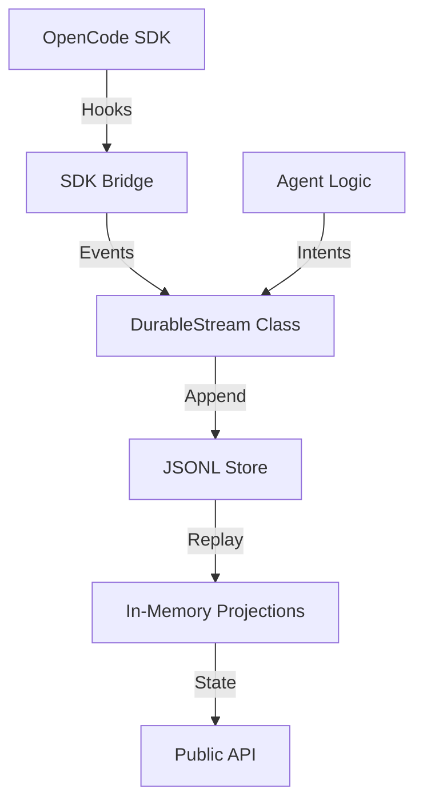

# Durable Stream Architecture

**Status**: v2.0 (Modular)
**Pattern**: Functional Core, Imperative Shell (Façade)

## 🏗️ High-Level Design

The Durable Stream module is designed to be the "source of truth" for agent orchestration. It eschews complex database schemas in favor of an **Event Sourcing** model where state is derived from an append-only log of immutable events.



## 🧩 Components

### 1. Functional Core (`core.ts`)
- **Pure Functions**: No side effects, no external dependencies.
- **Responsibilities**:
  - Event creation & validation
  - ID generation (deterministic where possible)
  - Filtering logic
  - Lineage tree construction
  - Checkpoint extraction

### 2. Storage Layer (`store.ts`)
- **Interface**: `IStreamStore`
- **Implementation**: `JsonlStore`
- **Mechanism**: Append-only writing to a `.jsonl` file.
- **Concurrency**: Uses `proper-lockfile` to ensure atomic writes in multi-process environments (OpenCode plugins may spawn multiple processes).

### 3. Orchestrator Façade (`orchestrator.ts`)
- **Role**: The "Shell" that manages side effects and state.
- **Responsibilities**:
  - Managing the `IStreamStore` lifecycle.
  - Maintaining in-memory **Projections** (e.g., `pendingCheckpoints` map).
  - Bridging OpenCode SDK events (`session.created`, `message.created`) into the stream.
  - Providing the `EventEmitter` interface for real-time reactivity.
  - **Legacy Compatibility**: Exposes methods like `subscribe` and `spawnAgent` to support older consumers.

## 🔄 Event Flow

1.  **Ingestion**: An event (from SDK or internal logic) is passed to `stream.append()`.
2.  **Persistence**: The event is written to the underlying Store (disk).
3.  **Projection**: The in-memory state (e.g., list of active Checkpoints) is updated immediately.
4.  **Emission**: The event is emitted via `EventEmitter` to notify listeners (e.g., `Observer`).

## 💾 Data Model

### Stream Event
```typescript
interface StreamEvent<T = unknown> {
    id: string;           // Global unique ID
    type: EventType;      // e.g., 'agent.spawned', 'checkpoint.requested'
    stream_id: string;    // Session ID or aggregate root ID
    correlation_id: string; // Trace ID
    timestamp: number;
    actor: string;        // Who performed the action
    payload: T;           // Domain data
}
```

### Projections
We maintain two primary projections in memory:
1.  **Pending Checkpoints**: Map of `checkpoint_id` -> `Checkpoint`. Rehydrated on startup.
2.  **Active Intents**: Map of `intent_id` -> `Intent`. Used to track long-running workflows.

## 🛡️ Resilience Strategy

- **Crash Recovery**: On startup (`resume()`), the system reads the entire JSONL log. It reconstructs the `pendingCheckpoints` map by replaying events (adding on `requested`, removing on `approved`/`rejected`).
- **Atomic Writes**: File locking prevents corrupted logs during partial writes or concurrent access.
